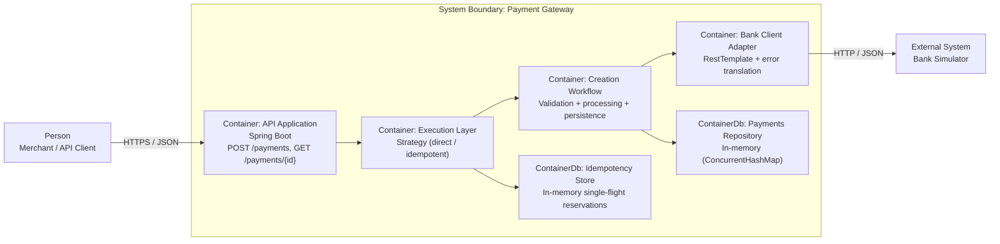

# Payment Gateway (C4 + Engineering Notes)

## C4 Container Diagram



## Quick Run

### Start the bank simulator:

```bash
docker compose up -d
```

Start the gateway:

```bash
./gradlew bootRun
```

- Bank simulator: [http://localhost:8080](http://localhost:8080)
- Gateway API: [http://localhost:8090](http://localhost:8090)
- Swagger
  UI: [http://localhost:8090/swagger-ui/index.html](http://localhost:8090/swagger-ui/index.html)
- OpenAPI JSON: [http://localhost:8090/v3/api-docs](http://localhost:8090/v3/api-docs)
- Actuator health: [http://localhost:8090/actuator/health](http://localhost:8090/actuator/health)
- Actuator metrics
  index: [http://localhost:8090/actuator/metrics](http://localhost:8090/actuator/metrics)

## Assumptions And Tradeoffs

- The implementation is intentionally single-node and in-memory (`ConcurrentHashMap`
  repositories/stores). This keeps the solution simple and fast to reason about, but data and
  idempotency state are lost on restart.
- Idempotency is implemented as process-local single-flight coordination. It prevents duplicate bank
  calls for concurrent identical requests on the same instance, but does not provide cross-instance
  guarantees.
- Failed idempotent owner executions remove the reservation entry so retries can succeed. This
  favors operability over strict failure retention history.
- Successful idempotency entries are retained in memory without TTL/eviction. This is acceptable for
  challenge scope but creates unbounded growth risk in a long-running process.
- Payment processing is synchronous (request thread waits for bank authorization). This simplifies
  correctness and replay semantics, but ties latency and availability directly to bank response
  behavior.
- Bank integration errors are translated at the adapter boundary into domain-facing exceptions (
  `BankUnavailableException` / `BankClientException`), preserving original causes for debugging
  while hiding transport-library details from upper layers.
- Retryable/unavailable bank HTTP statuses are narrowly treated as `502/503/504`; other failures map
  to generic bank client errors. This is explicit but conservative.
- Expiry validation follows the challenge wording strictly: expiry month + year must be in the
  future (current month is rejected), even though real card networks often treat cards as valid
  through month-end.
- `PaymentProcessor` returns a `PaymentDecision` (authorization result) and
  `PaymentCreationWorkflow` builds/persists the `PaymentRecord`. This keeps bank-authorization logic
  separate from persistence shaping at the cost of one extra type.
- The service layer is split into `creation`, `execution`, and `idempotency` subpackages for
  cohesion. This improves navigation and boundaries, but increases the number of small
  classes/types.
- Metric names are code constants (not config) to keep observability contracts stable and reviewable
  in code changes.
- No authentication, authorization, or transport hardening is implemented in the application layer (
  challenge-scope assumption). Endpoints are effectively open in local/dev usage unless protected
  externally.

## Potential Future Improvements

- Replace in-memory repositories/stores with durable persistence (payments + idempotency) and define
  clear retention/TTL policies.
- Make idempotency distributed (e.g., Redis/DB-backed reservations) to preserve single-flight
  semantics across multiple gateway instances.
- Add explicit idempotency expiration and cleanup to bound memory usage.
- Add production-grade security controls: authentication/authorization, TLS termination
  assumptions/documentation, rate limiting, secret management, request signing (if required), and
  stricter operational hardening.
- Introduce resilience controls around the bank client (timeouts per route, circuit breaker, retry
  with backoff where safe, bulkhead limits).
- Expand bank error policy (e.g., `429` handling, richer retryability classification, structured
  failure reasons).
- Extract a dedicated bank request mapper/value objects for card data formatting if the bank
  contract grows.
- Add config validation (`@Validated`, `@NotBlank`) for bank client properties and other operational
  settings.
- Strengthen observability with tracing/span propagation and richer metrics tags (outcome, replay,
  bank error class).
- Add performance/load tests for idempotent concurrency hot keys and memory-growth behavior.
- Tighten visibility (package-private where practical) after test package reorganization if codebase
  size grows further.

## E2E Tests (Bank Simulator Required)

The end-to-end bank simulator tests require the provided bank simulator to be running on
`localhost:8080`.

Start the bank simulator (if not already running):

```bash
docker compose up -d
```

Run tests:

```bash
./gradlew test
```

If the simulator is not running, E2E coverage against the real simulator will not execute
successfully.
